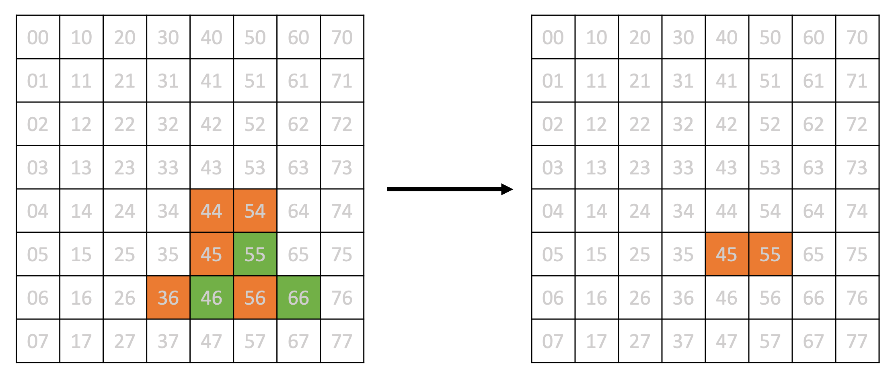
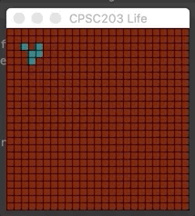

# Project 2: Cellular Automata

## Logistics

### PyGame

A cellular automaton in 2 dimensions can be represented as an evolving 2D grid of cells, each of which is colored according to its current state.  As such, it lends itself to animated visualization.  To generate such visualizations we employ PyGame, a lightweight game engine for Python that makes windowing and game state evaluation simple and accessible. In the given code you will see references to a few PyGame functions whose role is to set up and administer the game window. You can ignore these functions (unless you would like to learn more about interactive graphics).

That said, you do need to have the `pygame` module available.  Use the following command in your terminal to ensure it is installed:

```terminal
conda install -c conda-forge pygame
```

### Getting the Starter Code

**Do not** directly clone the [Project 2 template repository](https://github.com/ubc-cpsc203-2023W2/Project2)!  You have only write access to the template repository so you cannot push your changes to it.  Do not risk losing your work if your laptop crashes: Make your own copy of the repository using the instructions below.

Copy the template repository as a template in to your own GitHub account by following [these instructions](https://docs.github.com/en/repositories/creating-and-managing-repositories/creating-a-repository-from-a-template). Then clone your own copy to your local machine.  Using your own copy you can push and pull as much as you like (and we highly recommend that you push frequently to avoid risk of losing your work if your laptop crashes).

Make sure that your repository is **private** so that you are not unintentionally sharing your code with other students and thereby breaking [the course's academic dishonesty policy](https://ubc-cs.github.io/cpsc203/about/unsyllabus.html#what-is-considered-academic-dishonesty-in-this-course).

## The Game

In this project we will develop a platform for exploring grid-based simulations based on an approach commonly known as *cellular automata* (the latter word is a latinized plural form of an ancient greek word, so the singular form is cellular automat*on*). Like the Voronoi Diagrams and Markov Chains that we studied in class, cellular automata (CA) have broad applications across arts and sciences. Mathematicians and computer scientists have made careers of studying their features, and they allow scholars from application areas as diverse as epidemiology and traffic flow to assess innovations and policies. They are a powerful tool for experimentation, but they also lend themselves to (fairly) simple implementation; consequently, they are perfect for a project!

Classic examples of cellular automata include [Conway's Game of Life](https://en.wikipedia.org/wiki/Conway's_Game_of_Life) (GOL) and [Cyclic CA](https://en.wikipedia.org/wiki/Cyclic_cellular_automaton). The final result of this assignment will give you a general framework within which you can illustrate these two automata, in addition to many others.

## The Algorithm

### The general case

Consider a 2d grid, and imagine that every cell in the grid has a *state* at a particular point in time. A grid cell's *next* state is determined by its own current state and the current states of its neighbors, based on a given *rule*.

The illustration below shows a single time step for a cellular automata consisting of 64 cells in a grid. Each cell is in one of 3 states (white, green, and orange) in the first time step. The state of each cell in the next
time step is determined by a simple rule: a cell takes the *most common color* among its 8 neighbors. Most of
the cells will be white, but 45 and 55 will be orange (count for yourself to make sure you understand the rule!).



Note that in this example, another time step would yield an all white grid, and it would never change again in successive time steps.

In this project we will define two different rule sets. One corresponds to that of Conway's Game of Life, and the other corresponds to the Cyclic CA. We encourage you to experiment with other rules (such as the majority rule mentioned above). A little bit of research will give you about a bazillion different rules you might try.

Notice also that our example above assumed the set of neighbors was defined to be the 8 surrounding cells of a given cell. In the project you will choose the set of neighbors with a function; for example, the set of 4 non-diagonally adjacent cells north, south, east, and west (or equivalently up, down, right, and left), or the set of 8 adjacent cells including the diagonals.  There is no particular reason we need to stop at 8; for example, we could include the 8 surrounding cells plus one more in each NWSE direction for a total of 12 neighbors.

Finally, the number of states is something that we set as a global variable. Conway's Game of Life uses 2 states, the Cyclic CA uses any number (and you will want to experiment with different values).

### The initial state

In order to start a sequence of time steps, each cell must have an initial state. The utility of a simulation can depend profoundly on its initial grid configuration. In this project we ask you to implement two functions that the simulation can use to initialize the grid:

- One version which gives a fascinating result within Conway's GOL.
- A second version that simply generates a grid containing states uniformly chosen from the set of possible states.

## Examples

1. In this example we use [Conway's GOL rules](https://en.wikipedia.org/wiki/Conway's_Game_of_Life#Rules) on a 2-state grid of size 25 by 25 with an initial state that has a few carefully chosen non-zero entries in the upper left corner of the grid.  The resulting evolution looks like:

   

2. This example is exactly the same as the previous one (Conway's GOL on a 25 x 25 grid), except that we start the simulation with a random state in every cell.  The resulting evolution will look something like (realizing that you will probably have a different initial state):

   

3. The last example uses the [cyclic rules](https://en.wikipedia.org/wiki/Cyclic_cellular_automaton#Rules) on a grid of size 40 by 40 initialized randomly over 12 possible states.  The resulting evolution will look something like (realizing that you will probably have a different initial state):

   

## The Structure

The [Project 2 repository](https://github.com/ubc-cpsc203-2023W2/Project2) contains three main files: `main.py`, `control.py`, and `display.py`. These three files work together to run our game.

- The `main.py` file contains the main program loop that runs the game. It calls functions from both `control.py` and `display.py`.  *You do not need to modify this file.*
- The `display.py` file contains the display code. This is where most of our PyGame code is located.
*You do not need to modify this file.*
- The `control.py` file contains logic which implements the initial conditions and game rules.  *You will modify and eventually submit this file.*

To reiterate: The **only** file that you need to modify to complete this project is `control.py`.  Feel free to play around with the other code if you want to explore PyGame some more, but we *highly recommend that you keep a branch of your repository which focuses on completing the project requirements and in which only `control.py` is modified.*

## Deliverables

### Part 1: Basic Code

You must complete all of the requested code inside `control.py`. You can find the locations where you must write code by searching for the string "`# YOUR CODE`" in this file.  Our POTW this week and next will help you with these!

### Part 2: Creative Component (optional, no marks)

Once you have completed the basic code above, you will have an implementation which allows for easy experimentation with different CA.  We encourage you to play around and see if you can discover a novel and interesting CA.  To fully characterize your CA you will need to determine the following elements:

1. A grid size.
1. A number of states.
1. A neighborhood function.
1. An initialization function that sets up the grid for the first iteration.
1. A rule function.

We will consider your CA *novel* if it:

- Has a new rule function (not Conway's rules and not the cyclic rules) **and**
- Reuses *at most one* of the other elements from your basic code (one of grid size, number of states, neighborhood function or initialization).

To show us that you have completed this bonus, post your result as an animated `.gif` to Piazza in the `project 2` folder.  You should also include a brief writeup which:

- Explains what elements you chose (your grid size, number of states, neighborhood, initialization and rules).
- Describes why you think the CA is *interesting*.

To create an animated `.gif` of your CA, see the `SAVE_ANIMATION` global variable in `control.py`.

## Handing in your work

Submit the `control.py` file to PrairieLearn.  PL will only test the basic code which implements the three required examples, but if you did the bonus then please include that code in the file as well (with distinct function names).

## Optional resources

Here are some fun examples of cellular automaton applications.

- [Simulating COVID-19 with Cellular Automata](https://towardsdatascience.com/simulating-covid-19-with-cellular-automata-aeb820910a9)
- [Zero Player Game](https://www.youtube.com/watch?v=N-BbgqOjIqk)
